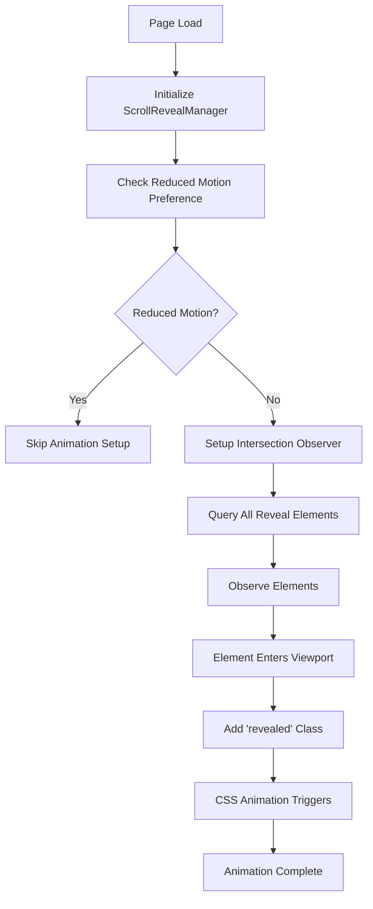

# Design Document

## Overview

The scroll reveal animation system will use the Intersection Observer API to detect when elements enter the viewport and trigger CSS-based animations. The system will build upon the existing CSS animation classes already defined in the HTML file, adding the JavaScript logic to activate them at the right moments.

## Architecture

### Core Components

1. **ScrollRevealManager**: Main class that orchestrates all scroll reveal functionality
2. **IntersectionObserver**: Browser API for efficient viewport detection
3. **Animation Classes**: Existing CSS classes that define animation styles
4. **Accessibility Handler**: Manages reduced motion preferences and accessibility concerns

### System Flow



## Components and Interfaces

### ScrollRevealManager Class

```javascript
class ScrollRevealManager {
  constructor(options = {}) {
    this.options = {
      threshold: 0.1,
      rootMargin: '0px 0px -50px 0px',
      staggerDelay: 100,
      ...options
    };
    this.observer = null;
    this.elements = [];
  }

  init() {
    // Initialize the scroll reveal system
  }

  setupObserver() {
    // Create and configure Intersection Observer
  }

  handleIntersection(entries) {
    // Process intersection events
  }

  revealElement(element, delay = 0) {
    // Trigger reveal animation for specific element
  }

  destroy() {
    // Clean up observers and event listeners
  }
}
```

### Animation Configuration

The system will work with existing CSS classes:
- `.reveal` - Basic fade-up animation
- `.reveal-left` - Slide in from left
- `.reveal-right` - Slide in from right
- `.reveal-scale` - Scale animation
- `.reveal-rotate` - Rotation animation
- `.reveal-stagger` - Container for staggered child animations

### Element Selection Strategy

Elements will be automatically detected using:
1. Existing reveal classes in the HTML
2. Semantic selectors for major content sections
3. Data attributes for custom configuration

## Data Models

### RevealElement Interface

```javascript
interface RevealElement {
  element: HTMLElement;
  animationType: string;
  delay: number;
  threshold: number;
  hasRevealed: boolean;
  staggerIndex?: number;
}
```

### Configuration Options

```javascript
interface ScrollRevealOptions {
  threshold: number;          // Intersection threshold (0-1)
  rootMargin: string;         // Root margin for observer
  staggerDelay: number;       // Delay between staggered animations (ms)
  animationDuration: number;  // Base animation duration (ms)
  easing: string;            // CSS easing function
  respectReducedMotion: boolean; // Honor prefers-reduced-motion
}
```

## Error Handling

### Graceful Degradation

1. **No Intersection Observer Support**: Fall back to immediate reveal of all elements
2. **Performance Issues**: Reduce animation complexity or disable on low-end devices
3. **CSS Animation Failures**: Ensure content remains visible even if animations fail

### Error Recovery

```javascript
try {
  // Animation logic
} catch (error) {
  console.warn('Scroll reveal animation failed:', error);
  // Immediately show all content without animation
  this.revealAllElements();
}
```

## Testing Strategy

### Unit Tests

1. **ScrollRevealManager initialization**
2. **Intersection Observer setup and configuration**
3. **Element detection and classification**
4. **Animation triggering logic**
5. **Accessibility preference handling**

### Integration Tests

1. **Full page scroll scenarios**
2. **Multiple elements entering viewport simultaneously**
3. **Staggered animation timing**
4. **Reduced motion preference integration**

### Performance Tests

1. **Large number of animated elements**
2. **Rapid scrolling scenarios**
3. **Memory usage during long sessions**
4. **Mobile device performance**

### Accessibility Tests

1. **Screen reader compatibility**
2. **Keyboard navigation with animations**
3. **Reduced motion preference respect**
4. **Focus management during animations**

## Implementation Considerations

### Performance Optimizations

1. **Lazy Observer Creation**: Only create observers when needed
2. **Element Batching**: Process multiple intersections in single frame
3. **Memory Management**: Unobserve elements after they've animated
4. **Throttling**: Limit animation frequency during rapid scrolling

### Browser Compatibility

- **Modern Browsers**: Full Intersection Observer support
- **Legacy Browsers**: Polyfill or graceful fallback
- **Mobile Safari**: Special handling for viewport changes

### Accessibility Features

1. **Reduced Motion Detection**: Check `prefers-reduced-motion` media query
2. **Focus Preservation**: Maintain focus states during animations
3. **Screen Reader Friendly**: Avoid disrupting assistive technology
4. **Keyboard Navigation**: Ensure animations don't interfere with tab order

## Animation Timing and Sequencing

### Staggered Animations

For elements with `.reveal-stagger` class:
1. Calculate stagger delay based on element index
2. Apply incremental delays using CSS custom properties
3. Ensure total sequence doesn't exceed reasonable duration

### Animation Phases

1. **Initial State**: Elements hidden with CSS transforms
2. **Trigger Phase**: Intersection detected, classes added
3. **Animation Phase**: CSS transitions execute
4. **Complete Phase**: Elements reach final state
5. **Cleanup Phase**: Remove unnecessary observers

## Integration Points

### Existing CSS Integration

The system will work seamlessly with existing CSS:
- Respect current animation durations and easing
- Maintain existing visual design
- Enhance rather than replace current styles

### Framework Compatibility

Design for compatibility with:
- Vanilla JavaScript (primary target)
- Potential future framework integration
- Server-side rendering scenarios